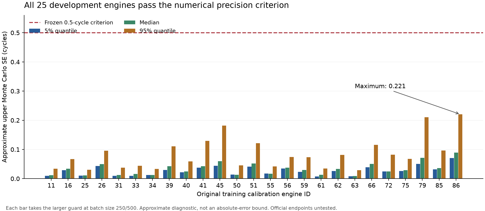

# Numerical precision remediation report v0.4

The historical v0.3 maximum approximate quantile MCSE **0.728972 cycles** exceeded **0.5**. That failure remains unchanged. The v0.4 numerical gate is **PASS** after the prospectively fixed study; no threshold relaxation, winning-subset selection, extra draws or seed retry occurred.

Principal fits use three independent seeds, four chains each and8,000 retained draws/chain:96,000 total/12 independent chains. All25 original eligible calibration engines, including86, and all75 .05/.50/.95 quantiles are assessed at250 and500 batch sizes. This is a sensor-only training-development precision study, without official test predictions or comparative performance evaluation.

Maximum approximate upper MCSE: **0.220513 cycles**. Minimum weight ESS 47452.123621; minimum influence ESS 54125.847394. The separate all-quantile estimator/replication/oracle gate is PASS; known-target estimator validation is PASS. An overall acceptance requires both, not just a favorable maximum.

| Engine | upperMCSE p.05 | upperMCSE p.50 | upperMCSE p.95 | weightESS | engine gate |
| --- | --- | --- | --- | --- | --- |
| 11 | 0.009351 | 0.012080 | 0.034108 | 92024.453149 | True |
| 16 | 0.029162 | 0.034106 | 0.066646 | 73147.960505 | True |
| 25 | 0.010354 | 0.011183 | 0.030214 | 89605.571491 | True |
| 26 | 0.043463 | 0.049724 | 0.095851 | 83122.727846 | True |
| 31 | 0.009912 | 0.012711 | 0.037398 | 92875.074112 | True |
| 33 | 0.009493 | 0.015796 | 0.043698 | 84225.671405 | True |
| 34 | 0.012414 | 0.012484 | 0.033523 | 91481.599992 | True |
| 39 | 0.029957 | 0.042536 | 0.110920 | 82332.209074 | True |
| 40 | 0.021628 | 0.024763 | 0.058756 | 89553.596251 | True |
| 41 | 0.037334 | 0.042799 | 0.129327 | 90981.234575 | True |
| 45 | 0.044295 | 0.060067 | 0.181687 | 87451.672163 | True |
| 50 | 0.014254 | 0.012895 | 0.045287 | 92079.386068 | True |
| 51 | 0.041111 | 0.052106 | 0.121581 | 82624.971944 | True |
| 55 | 0.017416 | 0.016967 | 0.042177 | 89932.472029 | True |
| 56 | 0.034702 | 0.037924 | 0.074244 | 90243.225382 | True |
| 59 | 0.023492 | 0.029453 | 0.073559 | 90067.357864 | True |
| 61 | 0.007390 | 0.012843 | 0.034870 | 47452.123621 | True |
| 62 | 0.026179 | 0.033571 | 0.081282 | 88209.853660 | True |
| 63 | 0.007944 | 0.009213 | 0.029002 | 91517.427545 | True |
| 66 | 0.038785 | 0.050776 | 0.115840 | 83146.649546 | True |
| 72 | 0.024908 | 0.025000 | 0.081939 | 91102.417226 | True |
| 75 | 0.026287 | 0.028798 | 0.067452 | 91304.880314 | True |
| 79 | 0.050244 | 0.071085 | 0.210230 | 83901.764962 | True |
| 85 | 0.031728 | 0.036122 | 0.096165 | 93256.681306 | True |
| 86 | 0.070318 | 0.089387 | 0.220513 | 89777.747572 | True |

## Estimator and uncertainty of its uncertainty

The weighted mixture CDF is solved directly. The ratio influence w(F_theta(q)-p) incorporates importance-weight normalization. Chain-wise nonoverlapping batch means estimate serial long-run variance, divided by squared predictive density; exponentiation converts log-scale error to cycles. Weight ESS is not autocorrelation-adjusted; influence ESS is quantity-specific. Satterthwaite degrees of freedom and a lower chi-square quantile at.05/(25×3×2) provide an approximate upper variance guard. Both250/500 guards must satisfy.5, along with weightESS>=1000,influenceESS>=400 and MCMC criteria.

This upper MCSE is an asymptotic approximation, not a finite-sample absolute-error bound or a rigorous simultaneous confidence limit. The guard assumes stable chains, adequate moments/mixing, positive smooth density and sufficiently independent Gaussian batch means. Estimated density and normalizer bring additional approximation. The lead derived the formula and independently checked variance/density algebra in [report08](08_independent_mathematical_reverification.md).

## Independent replication and sensor oracles

All225 pairwise seed/engine/quantile comparisons use the prespecified Bonferroni normal threshold z=3.692315, with each pair's combined MCSE. Compatible comparisons: 225/225. Maximum observed standardized difference: 3.277524.

Three joint-posterior sensor oracles were selected before results:engine11(first deterministic),61(lowest historical weightESS),86(worst historical MCSE). Each uses4chains×16,000 draws, adds that engine's sensors only to the56-engine likelihood, then predicts without double-weighting theta. All9 comparisons use z=2.772921; compatible 9/9. Their full MCSE and MCMC diagnostics are retained, including every quantile, in precision_summary.json. This cannot establish accuracy for every possible future sensor prefix.

## Known-target correlated-chain validation

The stationary AR(1) base has theta~N(0,1); observing z1 with unit variance gives theta|z~N(.5,.5). Predictive logR~N(log100+.1,.11) supplies exact lognormal quantiles. Each rho has200 independent replicates, four chains×2,000 draws, rootseed48001. The prospective criteria are RMSactualerror/RMSreportedMCSE in[.75,1.33] and normal95%MC interval coverage>=.90, checked at both batch sizes, for every rho/quantile. Empirical coverage has binomial uncertainty, with Wilson95% intervals in the full evidence; a200-replicate point pass does not certify universal calibration.

| rho | p | batch | RMSerror/MCSE | MC95%coverage | both criteria |
| --- | --- | --- | --- | --- | --- |
| 0.0 | 0.05 | 250 | 0.953073 | 0.955000 | True |
| 0.0 | 0.05 | 500 | 0.948710 | 0.945000 | True |
| 0.0 | 0.5 | 250 | 0.979598 | 0.940000 | True |
| 0.0 | 0.5 | 500 | 0.972402 | 0.960000 | True |
| 0.0 | 0.95 | 250 | 0.989284 | 0.950000 | True |
| 0.0 | 0.95 | 500 | 0.983949 | 0.940000 | True |
| 0.8 | 0.05 | 250 | 0.920257 | 0.970000 | True |
| 0.8 | 0.05 | 500 | 0.910361 | 0.960000 | True |
| 0.8 | 0.5 | 250 | 0.928015 | 0.970000 | True |
| 0.8 | 0.5 | 500 | 0.921710 | 0.960000 | True |
| 0.8 | 0.95 | 250 | 0.974176 | 0.955000 | True |
| 0.8 | 0.95 | 500 | 0.974213 | 0.950000 | True |
| 0.95 | 0.05 | 250 | 0.962725 | 0.950000 | True |
| 0.95 | 0.05 | 500 | 0.932357 | 0.950000 | True |
| 0.95 | 0.5 | 250 | 0.976135 | 0.950000 | True |
| 0.95 | 0.5 | 500 | 0.947290 | 0.945000 | True |
| 0.95 | 0.95 | 250 | 1.025218 | 0.925000 | True |
| 0.95 | 0.95 | 500 | 0.998837 | 0.925000 | True |

The retrospective batch-means analysis of the historical refit remains explicitly retrospective and cannot erase its historical failed decision. Current numerical PASS/FAIL applies to the new prior and the specified96,000-draw procedure, not retrospectively to v0.3 or to any future official endpoint.

Evidence: [all25 precision records](../../experiments/v0.4/analysis/principal_precision_all25.json), [independent replications](../../experiments/v0.4/analysis/principal_replication_precision.json), [oracle comparisons](../../experiments/v0.4/analysis/precision_summary.json), [600 known-target replications](../../experiments/v0.4/precision/v04_precision_mcse_validation.json), [historical retrospective diagnostic](../../experiments/v0.4/analysis/v03_retrospective_precision.json).

## Numerical guard across all calibration engines

The plotted value is the larger approximate upper MCSE at batch250/500 for each quantile. This figure uses the saved precision arrays, adds no sampling and certifies no future endpoint. [Vector PDF](../../figures/v0.4/predictive_precision_all25.pdf).
